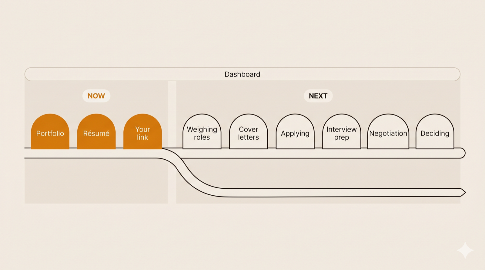

# JobHunt with Hope

> Tell Claude about your work. Get a designed portfolio website, a recruiter-ready résumé, and **one link you own** — free.

Free · open-source (MIT) · your data never leaves your machine

I built Hope while job-hunting. The one thing I've submitted with it — my portfolio — is getting interview calls.

<!-- IMAGE: portfolio-hero — see tasks/readme-image-prompts/ for the generation prompt -->
<p align="center"></p>

## What is this?

Hope is a free plugin for Claude. You talk to it; it builds your job-hunt presence:

- **A portfolio website that looks designed, not like a form** — with a living timeline of your career that visitors can play, hover, and click. Busy years rise like mountain peaks. A little character of your choice travels it.
- **A résumé PDF recruiters respect** — pick a style and font; key phrases bolded for the 7-second skim; your links clickable; the text never too small to read. Application systems read it perfectly.
- **One link you own** — published free to a page in *your* name. Paste it on LinkedIn and it unfurls with your own preview card. Visitors see a finished site; only you can change it.

Your facts live in one file on your computer: `career.json`. Hope also keeps a small notebook, `user-story.md` — how you like to work. Both are yours: open them, edit them, delete them. **No tracking. No accounts. Nothing leaves your machine** except the page you choose to publish.

<!-- IMAGE: data-stays-home — see tasks/readme-image-prompts/ for the generation prompt -->
<p align="center"></p>

## How to use it

1. **Install** (in [Claude Code](https://claude.com/claude-code) or the Claude desktop app):
   ```
   /plugin marketplace add oneconsciousness/claude-job-hunt-with-hope
   /plugin install hope@hope
   ```
2. **Open a fresh chat in an empty folder** and type: **start my job hunt with Hope.**
3. Hand it what you have — a resume file, your LinkedIn, your GitHub, a folder of old career files, or just a conversation. Hope does the work and walks you to your live link.

> **What you need:** access to Claude (a paid plan or API billing). Hope itself is free.

<!-- IMAGE: how-hope-works — see tasks/readme-image-prompts/ for the generation prompt -->
<p align="center"></p>

## How to update

- **Your portfolio:** say **update my portfolio** — Hope asks what changed (your story, the look, what's featured) and offers to pick up the newest Hope features. Then say **publish the changes** — same page, same link.
- **Hope itself:** rerun the install —
  ```
  /plugin uninstall hope@hope && /plugin install hope@hope
  ```
  then start a fresh chat so the newest Hope loads. Nothing is lost — everything lives in your folder, and Hope hands you a short summary to carry into the new chat.

## Roadmap

This release does **presentation** — portfolio, résumé, publish — and does it well. Designed and waiting for later releases: weighing roles, tailored cover letters, applying with care, interview prep, negotiation support, deciding, and a dashboard across all of it.

<!-- IMAGE: roadmap — see tasks/readme-image-prompts/roadmap.md for the generation prompt -->
<p align="center"></p>

## How to contribute

Found something broken, or want to build on Hope? **Reach out on LinkedIn: [in/arunganpa24](https://www.linkedin.com/in/arunganpa24).**

If you work with a coding agent, [`CONTRIBUTING.md`](CONTRIBUTING.md) is written for it — and the design and voice that make Hope feel like Hope are documented in [`references/`](references/).

## Like it?

**Leave a ⭐ on this repo and share the link** — every share puts a free portfolio within reach of someone who needs work.

## License

MIT. See [`LICENSE`](LICENSE). Free to use, change, and share. Hope stands on the work of others — see [`CREDITS.md`](CREDITS.md).

---

If you need work, install it and start.
